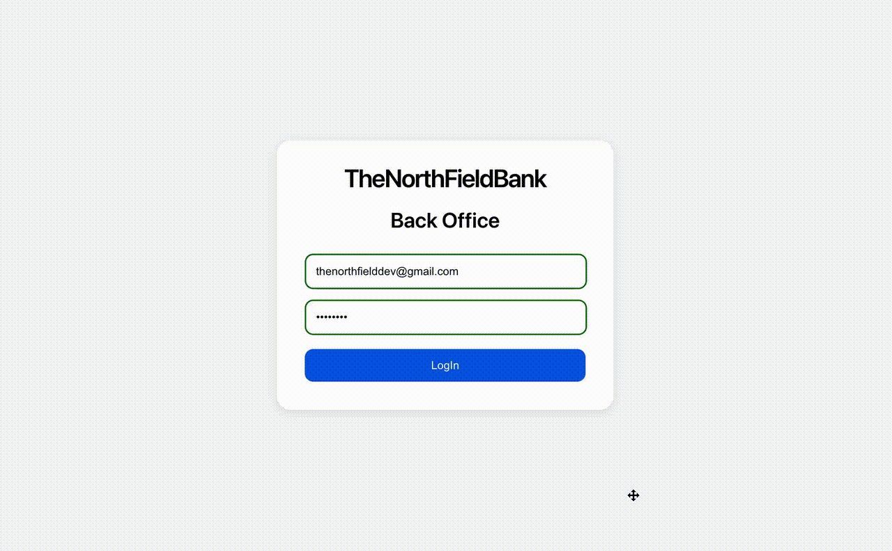
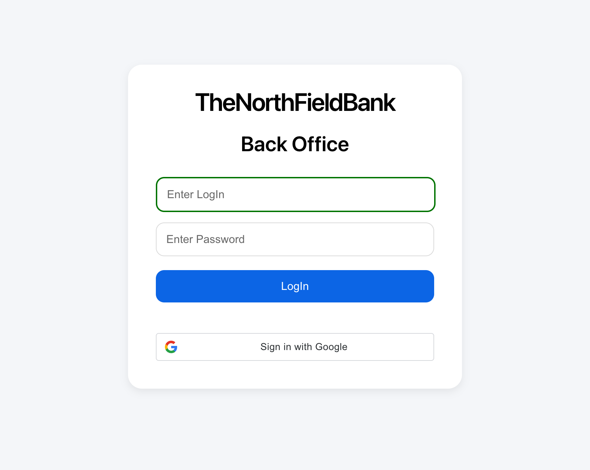
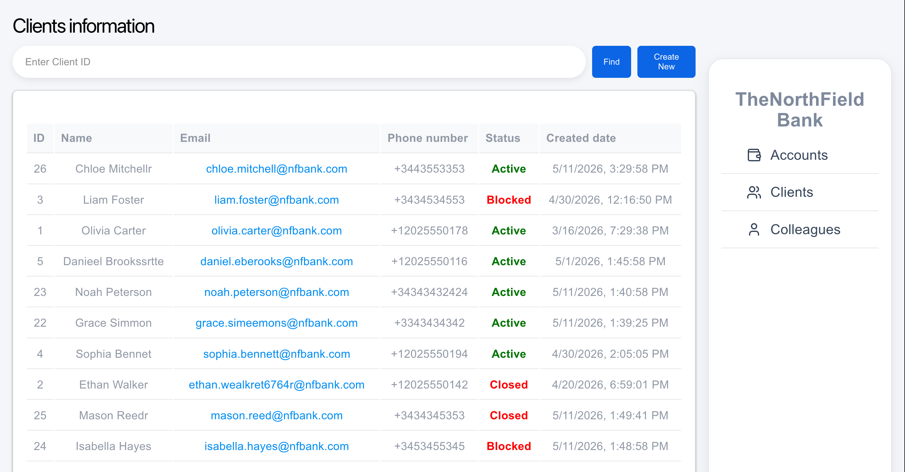
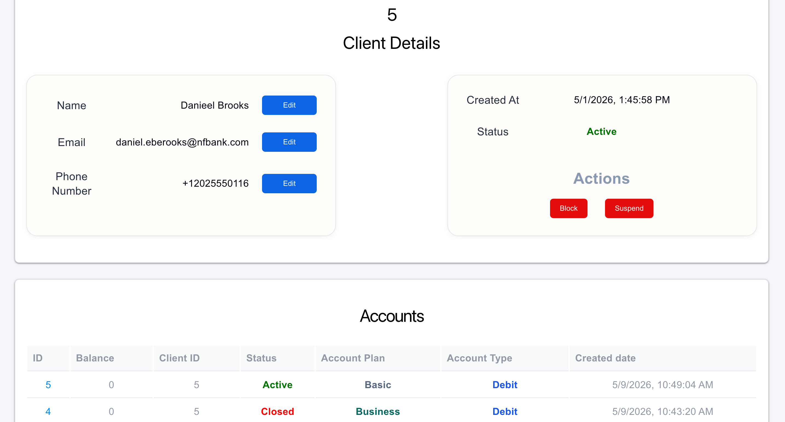
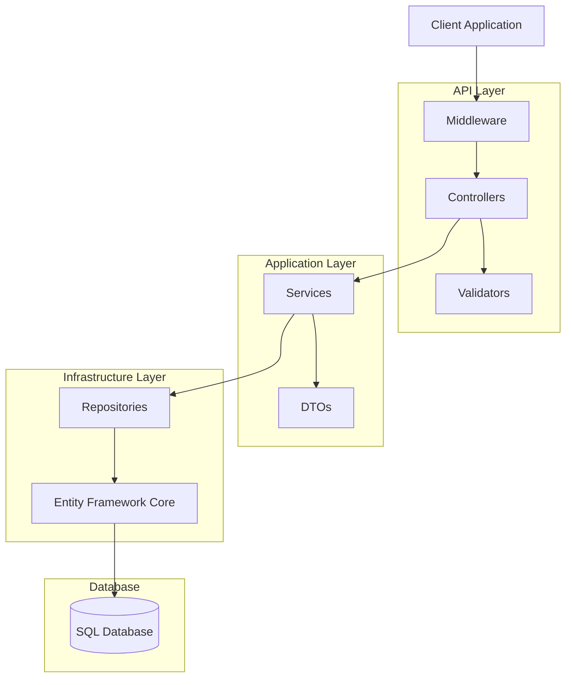
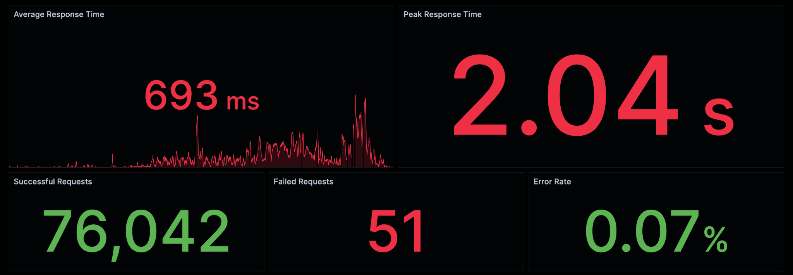
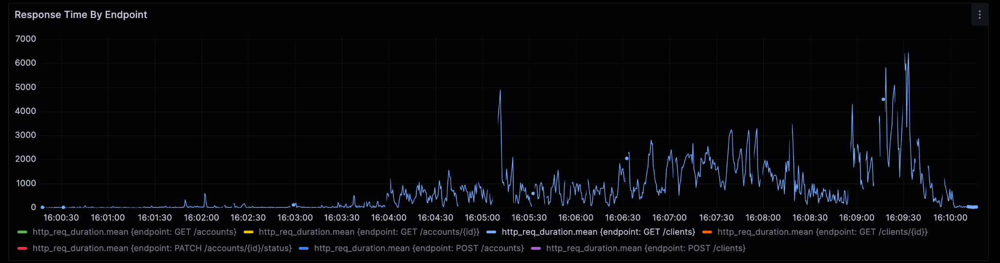
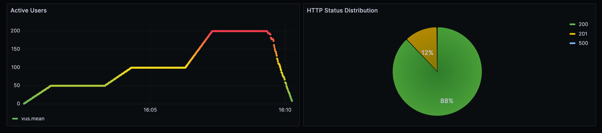
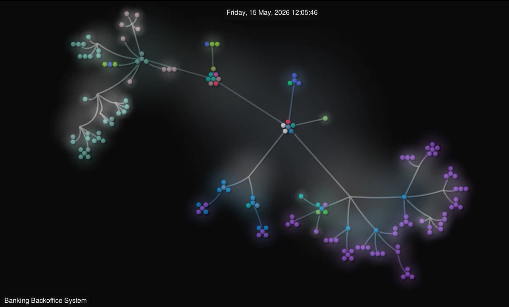

# Banking Backoffice System

Full-stack banking management application built with ASP.NET Core and React.

The project includes JWT authentication, role-based authorization, client/account management, and a responsive frontend dashboard.

## Demo
<p align="center">
  
</p>

## Screenshots

### Login Page


### Clients Dashboard


### Client Details


## Tech Stack

### Backend
- ASP.NET Core Web API
- Entity Framework Core
- PostgreSQL
- JWT Authentication
- FluentValidation
- xUnit

### Frontend
- React
- JavaScript
- Axios
- React Router

### DevOps
- Docker
- GitHub Actions
- Render
- Supabase

## Features

- JWT authentication
- Role-based authorization
- Secure protected endpoints
- Client management
- Bank accounts and clients management
- Frontend dashboard
- API validation
- Swagger documentation
- Responsive UI
- CI/CD with GitHub Actions


## Deployment
The project is deployed using Render and Supabase.

Live API(Swagger): https://banking-api-dotnet-2.onrender.com/swagger

Frontend Application: https://banking-api-application.onrender.com/

### Test Credentials

Email: test@gmail.com  
Password: test

## API Usage

You can test all endpoints directly using Swagger UI.

Base URL: 

https://banking-api-dotnet-2.onrender.com/swagger

---

## Authentication Flow

### 1. Log in using the test credentials

Use the following credentials to obtain a JWT token.

Email: test@gmail.com  
Password: test  

Endpoint: `POST /api/auth/login`

Example request:

```json
{
  "email": "test@gmail.com",
  "password": "test"
}
```

Example response:

```json
{
  "token": "your_jwt_token"
}
```

Save the token returned by the API.

---

### 2. Authorize requests

To access protected endpoints:

1. Open Swagger UI  
2. Click **Authorize**  
3. Enter the token in the following format:

```
Bearer YOUR_TOKEN
```

---

### 3. Example request to a protected endpoint

Create a new client.

Endpoint: `POST /api/clients`

Example request:

```json
{
  "name": "Milinda Robinson",
  "email": "testClient@gmail.com",
  "phoneNumber": "134547895"
}
```

Example response:

```json
{
  "id": 1,
  "name": "Jack",
  "email": "jack@income.com",
  "phoneNumber": "3456553464",
  "created": "created-time",
  "status": 0
}
```


## Project Structure
- Controllers – API endpoints
- Data – database context
- Configuration – application configuration and settings
- DTOs – request/response models
- Middleware – custom request/response pipeline components
- Migrations – Entity Framework database migrations
- Models – entities
- Repositories – data access layer
- Services – business logic    
- Validators – request validation logic


## Architecture


    

## Performance Testing

Load testing was performed using:

- k6
- InfluxDB
- Grafana

### Test Scenario

Workload distribution:

- 70% Read operations
- 20% Create operations
- 10% Update operations

Virtual users:

- 50 users
- 100 users
- 200 users

Test duration: 10 minutes

### Results

| Metric | Result |
|----------|----------|
| Total Requests | 76,093 |
| Successful Requests | 76,042 |
| Failed Requests | 51 |
| Error Rate | 0.07% |
| Average Response Time | 693 ms |
| Peak Response Time | 2.04 s |
| Max Concurrent Users | 200 |

## Performance Test Results

### Key Metrics



### Endpoint Response Time Analysis



### Load Profile and HTTP Status Distribution



## Development Timeline

Visualization of the repository evolution using Gource.

[](./screenshots/gource.mp4)

    


